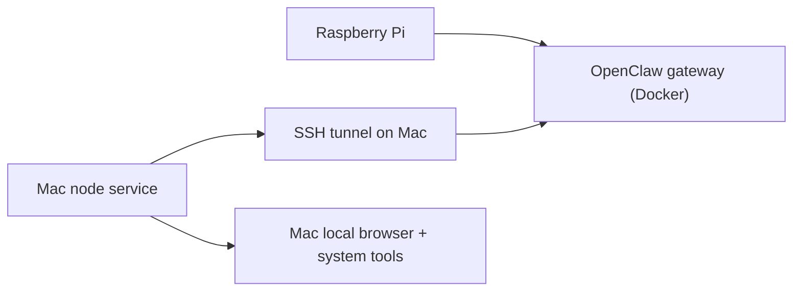

# OpenClaw Node Playbook

Practical notes for running an OpenClaw gateway on a Raspberry Pi and attaching a macOS machine as a node.

This repo documents a real deployment with these properties:

- Raspberry Pi runs the OpenClaw gateway in Docker
- A macOS machine connects as a node
- The node is used for local browser and system capabilities
- Gateway/UI pairing can succeed while `exec` still fails for runtime-safe-binding reasons

## What This Repo Covers

- Docker-based gateway deployment on the Pi
- Why `Update now` in the UI does not update a Docker-pinned gateway
- How to attach a macOS node
- How to route the node through an SSH tunnel when needed
- What approvals actually matter
- Why `exec` may still fail after approvals are opened
- What command shapes work and which ones do not

## Architecture



Operationally:

- The Pi is the control plane
- The Mac is the execution plane for local browser and system work
- The gateway can show the node as `paired` and `connected` while `exec` still fails for runtime safety reasons

## Deployment Layout

Pi host:

- Compose root: `/home/jason/openclaw-pilot`
- Compose file: `/home/jason/openclaw-pilot/docker-compose.yml`
- Image pin: `/home/jason/openclaw-pilot/.env`

Important note:

- In a Docker deployment, the UI `Update now` action is not authoritative
- The running version is determined by the image tag in `.env`

Upgrade pattern:

1. Change `OPENCLAW_IMAGE=...` in `.env`
2. `docker compose pull`
3. `docker compose up -d`

## Node Setup Summary

macOS side:

- Local node config: `~/.openclaw/node.json`
- Local auth: `~/.openclaw/identity/device-auth.json`
- Local approvals: `~/.openclaw/exec-approvals.json`
- LaunchAgent for node host
- Optional SSH tunnel to the Pi gateway

In the working setup:

- The Mac node connects to `127.0.0.1:28789`
- The local tunnel forwards to `192.168.216.88:18789` on the Pi

Reason:

- OpenClaw was happier with a loopback-bound local target on the Mac
- The tunnel preserved that while still reaching the Pi gateway

## Exec Policy That Was Applied

Gateway-side `tools.exec` was explicitly set to:

- `tools.exec.host = node`
- `tools.exec.security = full`
- `tools.exec.ask = off`
- `tools.exec.node = jason-mac`

Host approvals on both the gateway and the node were also opened.

That is necessary, but not sufficient.

## The Important Failure Mode

The key observed failure was:

```text
INVALID_REQUEST: SYSTEM_RUN_DENIED: approval cannot safely bind this interpreter/runtime command
```

This was **not** caused by:

- pairing failure
- node disconnection
- missing host approvals
- missing gateway approvals

It came from OpenClaw runtime safe-binding behavior.

## What Actually Worked

### Worked

- `id`

This shape executed successfully through the node.

### Failed

- `/bin/sh -lc "id"`
- `bash -lc "..."`
- direct shell-wrapper multi-line commands
- fixed script-path attempts in this specific runtime path
- other interpreter/runtime wrapper forms

Even after:

- node was connected
- `tools.exec.security=full`
- `tools.exec.ask=off`
- host approvals were opened

### Practical rule

Do not assume "approval required" means approvals are not configured.

In this setup, the stronger rule was:

> OpenClaw could reach the node, but refused to bind approval to many interpreter/runtime command forms.

## Operational Guidance

### If you need simple remote checks

Prefer the simplest possible direct executable form first.

Examples:

- `id`
- other single binary invocations with minimal argv

### If you need browser/system discovery

Prefer node-native commands or node-native capabilities over shell composition.

Examples:

- `system.which`
- `browser.proxy`

Do not default to `sh -lc` wrappers.

### If you need complex workflows

Avoid packing logic into one `exec` command.

Prefer one of:

- a node-native command surface
- a browser-native route such as `browser.proxy`
- a workflow that avoids shell-wrapper approval binding

## Lessons Learned

1. Pairing success is not the same as runnable `exec`.
2. Docker-based OpenClaw upgrades must be done from the host deployment, not from the in-app update button.
3. `tools.exec.*` and host approvals both matter.
4. Even after both are opened, safe-binding can still deny interpreter/runtime command forms.
5. For node-based browser work, `browser.proxy` is a better next step than continuing to force shell-based `exec`.

## Recommended Next Step

If your goal is browser automation on the node:

- treat `browser.proxy` as the preferred route
- treat `exec` as a fallback for very simple direct commands only

## Files

- [Chinese README](./README.zh-CN.md)
- [Troubleshooting](./docs/troubleshooting.md)
- [Skill](./SKILL.md)
