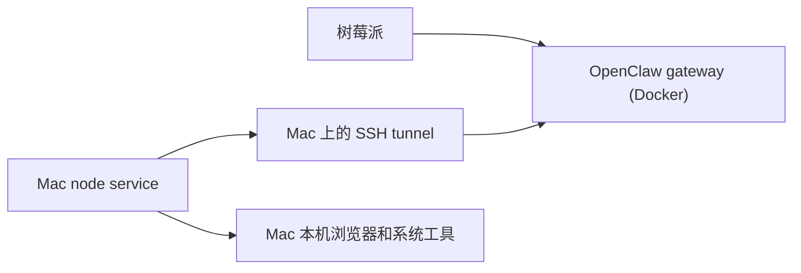

# OpenClaw Node 接入手册

> 语言 / Language: [English](./README.md) | **简体中文**
>
> 当前是中文文档。返回默认首页请点上面的 `English`。

这是一份实战版记录，主题是：

- 树莓派上用 Docker 跑 OpenClaw gateway
- 一台 macOS 机器作为 node 接进来
- node 用来承接本机浏览器和系统能力
- 即使 UI 里已经 `paired` + `connected`，`exec` 仍然可能因为 runtime safe-binding 被拒
- 即使 node 看起来带了 `browser.proxy`，如果本机把 `browser` 插件过滤掉，gateway 仍然会报 `browser control disabled`

## 这份仓库讲什么

- Pi 上 Docker 部署结构
- 为什么 UI 里的 `Update now` 对 Docker 固定镜像部署不生效
- macOS node 怎么接入
- SSH tunnel 为什么会用上
- approvals 到底改哪几层
- 为什么 approvals 都放开了，`exec` 还是会失败
- 哪类命令能过，哪类命令会被拦
- 为什么 `browser control disabled` 可能是 node 本机插件白名单导致的

## 架构



职责分层：

- Pi 是控制面
- Mac 是执行面
- node 在 UI 里显示 `connected`，不代表 `exec` 一定能跑

## Docker 部署的关键点

Pi 宿主机：

- 根目录：`/home/jason/openclaw-pilot`
- compose 文件：`/home/jason/openclaw-pilot/docker-compose.yml`
- 镜像版本固定在：`/home/jason/openclaw-pilot/.env`

重点：

- 这类 Docker 部署里，UI 的 `Update now` 不是主升级路径
- 实际运行版本由 `.env` 里的镜像 tag 决定

正确升级方式：

1. 改 `.env` 里的 `OPENCLAW_IMAGE`
2. `docker compose pull`
3. `docker compose up -d`

## Node 接入摘要

macOS 端涉及这些：

- `~/.openclaw/node.json`
- `~/.openclaw/identity/device-auth.json`
- `~/.openclaw/exec-approvals.json`
- node host 对应的 LaunchAgent
- 可选 SSH tunnel

这次跑通时的形态：

- Mac node 连 `127.0.0.1:28789`
- 本机 tunnel 再转到 Pi `192.168.216.88:18789`

原因：

- Mac 侧本地 loopback 绑定更稳定
- tunnel 只是把本地 loopback 流量安全转给 Pi gateway

## 一个很容易漏掉的 browser.proxy 条件

node 本机不能把 `browser` 插件从白名单里排掉。

这次 Mac node 原来的坏配置是：

```json
"plugins": {
  "allow": ["telegram"]
}
```

这会把 `browser` 插件直接过滤掉。结果就是 Pi gateway 侧会出现：

```text
INVALID_REQUEST: Error: browser control disabled
```

哪怕你在节点状态里还能看到：

- `caps: ["browser", "system"]`
- `commands: ["browser.proxy", ...]`

最后真正修好的配置是：

```json
"plugins": {
  "allow": ["telegram", "browser"],
  "entries": {
    "browser": { "enabled": true }
  }
}
```

改完以后必须重启 node host。

## 已配置的 exec 策略

gateway 侧显式写了：

- `tools.exec.host = node`
- `tools.exec.security = full`
- `tools.exec.ask = off`
- `tools.exec.node = jason-mac`

同时 gateway 和 node 两侧的 approvals 也都放开了。

但这还不够。

## 真正的核心问题

这次反复遇到的错误是：

```text
INVALID_REQUEST: SYSTEM_RUN_DENIED: approval cannot safely bind this interpreter/runtime command
```

它不是这些原因导致的：

- 设备没配对
- node 没连上
- approvals 文件没开
- gateway approvals 没开

它来自 **OpenClaw runtime 的 safe-binding 规则**。

## 哪些命令实际能过

### 能过

- `id`

这是最小裸命令，实际验证成功。

### 过不了

- `/bin/sh -lc "id"`
- `bash -lc "..."`
- 多行 shell 包装命令
- 很多“解释器/运行时包装”形式
- 这条路径下连固定脚本路径也可能被拦

即使下面这些都已经配置好了，仍然会失败：

- node 已连接
- `tools.exec.security=full`
- `tools.exec.ask=off`
- host approvals 已放开

### 实战规则

不要把所有 `approval required` 都理解成 approvals 没配好。

这次更准确的理解是：

> OpenClaw 已经能调到 node，但 runtime 不愿意给很多解释器包装命令做 safe binding。

## 实战建议

### 只做简单远程检查

先尝试最简单的裸命令。

例如：

- `id`

### 做浏览器/系统发现

优先用 node 自带能力，不要先堆 shell。

例如：

- `system.which`
- `browser.proxy`

不要默认上来就 `sh -lc`。

### 如果 gateway 还报 `browser control disabled`

优先检查 node 本机，而不是只盯着 Pi gateway。

最短检查顺序：

1. node 本机 `browser.enabled=true`
2. node 本机 `plugins.allow` 里包含 `browser`
3. 重启 node host
4. 回到 gateway 上重新跑 `openclaw browser status`

这次实际修好后，Pi gateway 已能成功执行：

- `openclaw browser status`
- `openclaw browser open https://example.com`

### 做复杂流程

不要把逻辑全塞进一条 `exec` 命令里。

更合适的是：

- 用 node 原生命令面
- 用 `browser.proxy`
- 或者换掉依赖 shell wrapper 的流程

## 结论

1. UI 里 `paired` / `connected` 不等于 `exec` 一定可跑。
2. Docker 部署下，升级要改宿主机 `.env`，不是点 UI。
3. `tools.exec.*` 和 host approvals 两层都要对齐。
4. 两层都开了之后，runtime safe-binding 仍然可能拦解释器包装命令。
5. node 本机的 `plugins.allow` 如果漏掉 `browser`，会让 browser 路由继续坏掉。
6. 对 node 浏览器工作流，下一步应优先走 `browser.proxy`，不要继续在 `exec` 上堆复杂 shell。

## 文件

- [English README](./README.md)
- [故障排查](./docs/troubleshooting.md)
- [Skill](./SKILL.md)
